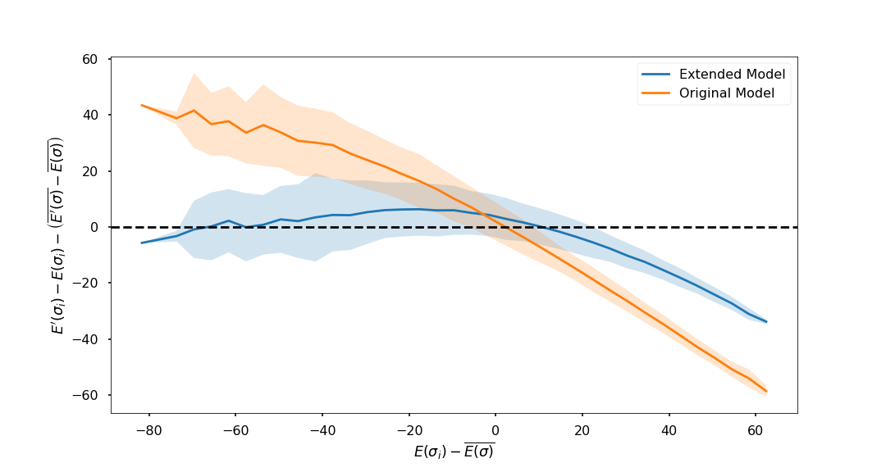
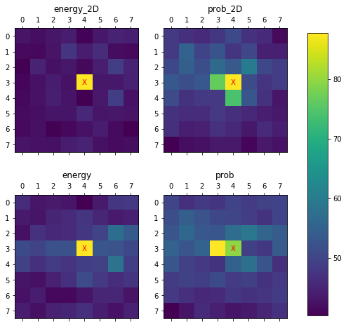

# Watch and Learn

This repository extends the work done by Sprague K. et al. in [Watch and learn](https://arxiv.org/abs/2003.02647). The main objective is to leverage the concept of language models to calculate the energy of a system through the probability of its state.

The two main contributions of the repository are:
1. Monte Carlo process implemented in [Jax](https://github.com/google/jax) to speed up --around 6x on CPU-- the generation of datasets required to train the model.
2. Development of models extending Sprague et al. 's ideas using PyTorch and [PyTorch Lightning](PyTorchLightning).

The extensions I made to the model proposed by Sprague et al. are:
1. Use bidirectional RNNs to access information from neighbors on both sides of an element on the grid.
2. Include an attention layer to facilitate information flow across the flattened grid.
3. Feed the model data flattened through rows and columns to leverage the 2D structure and make more accessible the state of the four neighbors.
4. Calculate the loss on the energy instead of the loss on the probability of the sequence's elements.

The plot below compares the performance across energy values of the model developed by Sprague et al. (Original Model) and a model that includes one attention layer and a bidirectional RNN and calculates the loss function directly on the energy prediction (Extended Model). The **RMSE scores** of the extended and original models are **7.79 and 19.9** in the test set. The RMSE scores and the plot show that the extensions are useful to improve energy predictions using language models.



The table below shows in more detail the effect of the different extensions on the RMSE calculated on the test set. You can find the details of the four extensions on the [Models section](#models) and the RMSE scores for all possible combinations on the Model Evaluation notebook.

<center>

|               Model Extensions              | RMSE |
|:-------------------------------------------:|:----:|
| Energy GRU + Attention + 2D + Bidirectional | 7.79 |
| Energy GRU + Attention                      | 12.7 |
| Energy GRU + Bidirectional                  | 13.6 |
| Energy GRU + 2D                             | 14.2 |
| Energy GRU                                  | 15.8 |
| Probability GRU (Original Model)            | 19.9 |

</center>

## Data Generation Process
The data generation process is in the `generate_ising.py` script. The idea of rewriting the process from numpy to Jax was to leverage the JIT compilation functionality. JIT compilation allows a speedup of around 6x compared to generating the data using pure numpy. 

The process that generates the data is a Monte Carlo process using a Metropolis update rule. The update rule depends on the temperature of the simulated system. I checked that the chains and the energy distribution generated with the script passed basic consistency checks using the functions available in the Consistency Checks notebook.

I store the data in HDF5 files to avoid loading potentially large files into memory. [h5py](https://github.com/h5py/h5py) is a Python library that offers all the functionalities necessary to work with HDF5. I use all these functionalities in the context of PyTorch's DataLoaders that are available in the `pytorch_datasets.py`.

## Models

There are two types of models available in the repository: energy-based and probability-based. The difference between the two is that the former calculates the loss function directly on the energy of the system. In contrast, the latter calculates the loss function on the prediction of the microstates. Calculating the loss function on the microstate prediction prevents the model from adjusting the gradients to the actual quantity of interest: the system's energy. All models are available in the `energy_models.py` and `probability_models.py`.


The model that includes all the four extensions achieved the best results calculating the energy of the system.

I developed all the models using PyTorch using the functionalities available in PyTorch Lightning. Developing all the models using PyTorch Lightning allows delegating several training functionalities to PyTorch Lightning's `Trainer` objects. The training pipelines for energy and probability models are available in `energy_trainer.py` and `probability_trainer.py`, respectively.

### Attention Visualization

Plot of attention weights for the (3, 4) position on the grid for different models. the visualization can be generated with the Attention Visualization notebook.



## How to Run

You can run the data generating process using the command below. The script has several arguments for adjusting the generation process. Please refer to the script for the meaning of each parameter or run the command below with the `--help` flag.

```
python generate_ising.py
```

You can run the training process of any model using `energy_trainer.py` or `probability_trainer.py` depending on the model. These scripts have multiple hyperparameters that can be adjusted using command line arguments. You can use the default settings, but make sure that the datasets (created using `generate_ising.py`) are available in the paths set in the scripts by default --e.g., `./data/train_data.hdf5` for the training set.

